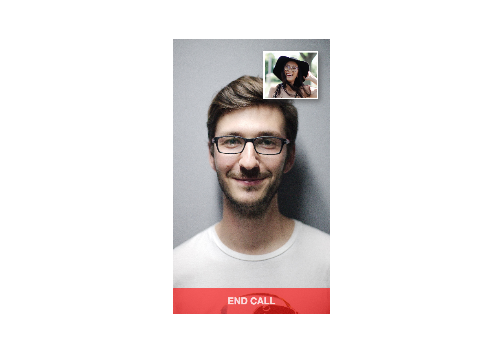
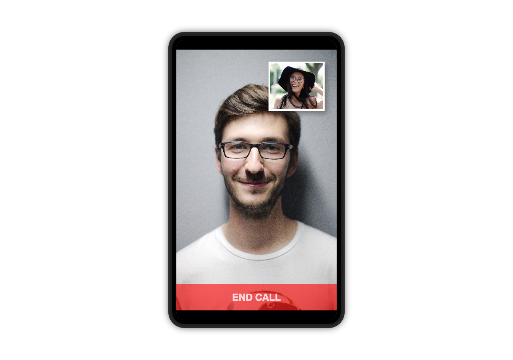
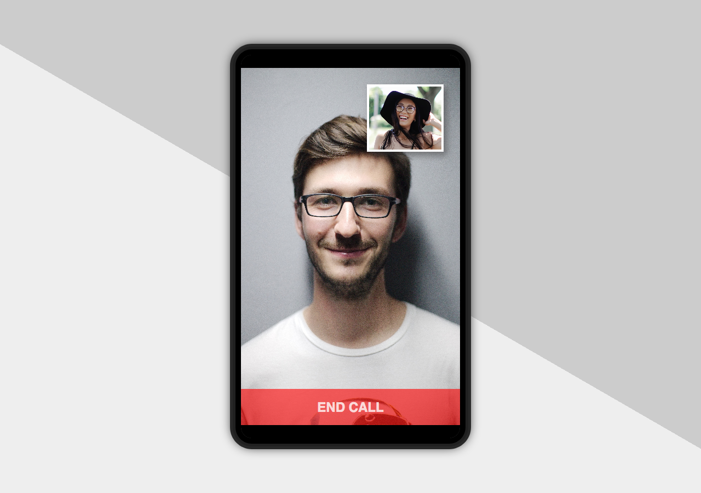

# In a call

Let's try to create the following layout:

* [] the image of the caller takes up the most space
* [] center the layout on screen on desktop (no need to make it look good on mobile) - you can use fixed width and height
* [] the red button is positioned on top of the image
* [] the red button is semi transparent so you can see the image below through the button
* [] the receiver's image is positioned in the top right corner, but not exactly at the edge
* [] the receiver's image has a border
* [] the receiver's image has shadow effect

## Extra

* [] add a phone frame

* [] add a background

